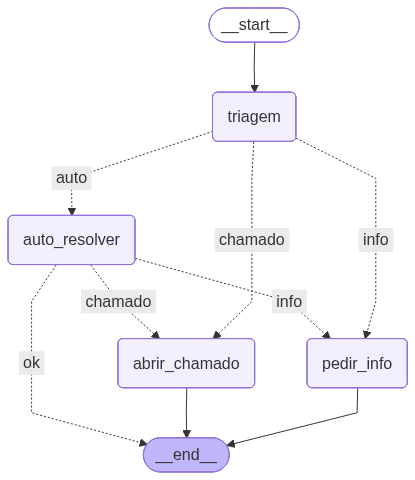

# Imersão Dev Agentes de IA Google - Alura

> Durante a Imersão Dev Agentes de IA da Alura com o Google Gemini, você não vai apenas rodar prompts, vai criar um sistema de agentes inteligente que decide o que fazer, quando consultar informações e como responder com precisão.

### Aula 01 - Classificação de intenções com IA

Na primeira aula, você vai aprender a configurar o modelo Gemini 2.5 Flash no LangChain e começar a construir seu primeiro agente inteligente. De forma prática, você vai escrever prompts, organizar as respostas em JSON e criar uma chain de triagem para classificar mensagens em categorias.

- Configurar o modelo Gemini 2.5 Flash no LangChain.
- Escrever prompts de sistema claros para triagem de mensagens.
- Estruturar saídas em JSON com Pydantic para garantir previsibilidade.
- Criar uma chain de triagem para classificar mensagens em três categorias.
- Desenvolver um classificador funcional como base do agente.

### Aula 02 - Construindo a base de conhecimento com RAG
Nesta segunda aula, você vai aprender a trabalhar com documentos PDF e transformar essas informações em conhecimento utilizável pelos seus agentes. Vai entender como dividir textos longos em partes menores, criar embeddings e armazenar tudo em uma Vector Store para facilitar a busca. No fim, você terá uma chain RAG capaz de responder perguntas usando os documentos como base.

- Carregar e processar documentos PDF.
- Dividir textos longos em chunks para otimizar a busca de informações.
- Criar embeddings e armazenar em uma Vector Store com FAISS.
- Construir uma chain RAG que busca contexto e gera respostas baseadas em documentos.
- Formatar respostas com citações exatas das fontes consultadas.

### Aula 03 - Orquestração do agente com LangGraph
Nesta aula, você vai aprender a estruturar o fluxo do agente usando o LangGraph. De forma prática, você vai definir estados, transformar funções em nós de grafo, implementar roteamentos condicionais e visualizar o fluxo completo para entender as decisões do agente.

- Definir um estado do agente para armazenar informações do fluxo.
- Transformar as principais funções (triagem, auto-resolver, pedir informação, abrir chamado) em nós de grafo.
- Implementar a lógica de roteamento condicional entre os nós.
- Montar e compilar o grafo no LangGraph para execução do fluxo completo.
- Visualizar o fluxo em diagrama para entender as decisões do agente.

## Finalidade deste repositório 
- [ ] **Estudo**: Este projeto foi criado para fins de aprendizado e prática.
- [x] **Curso**: Este projeto é parte de um curso específico.
- [ ] **Projeto Real**: Este projeto é uma aplicação real a ser publicado.

